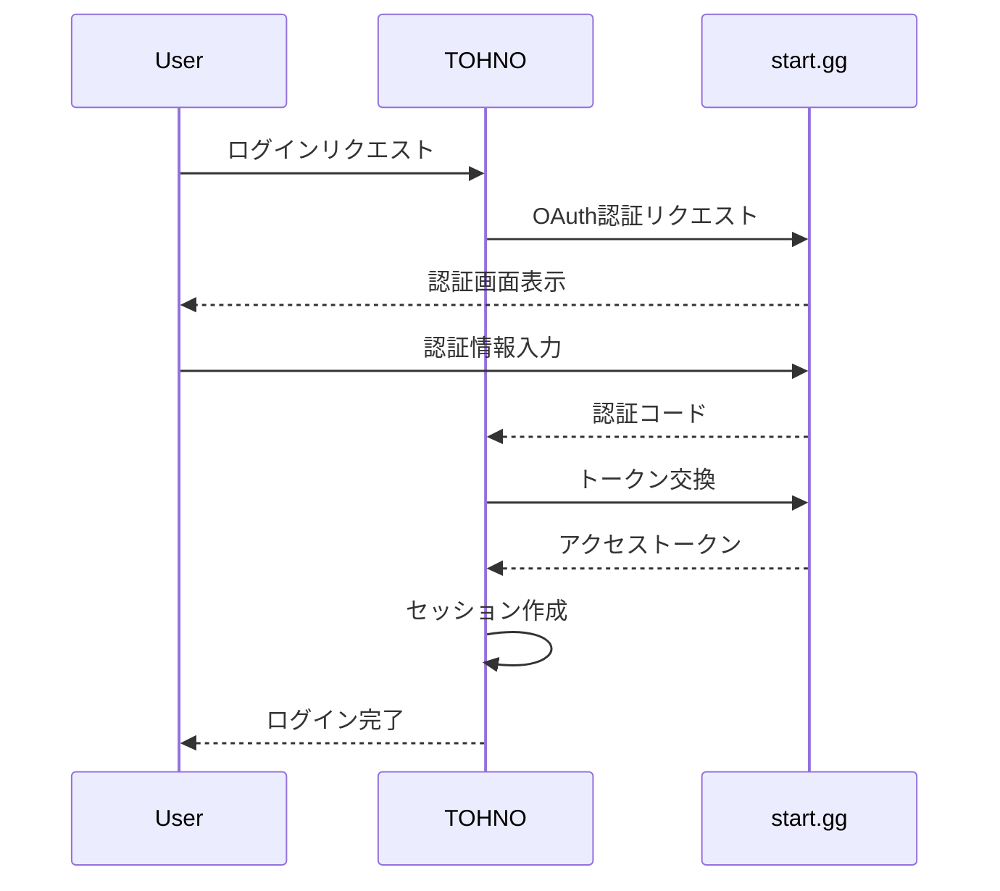
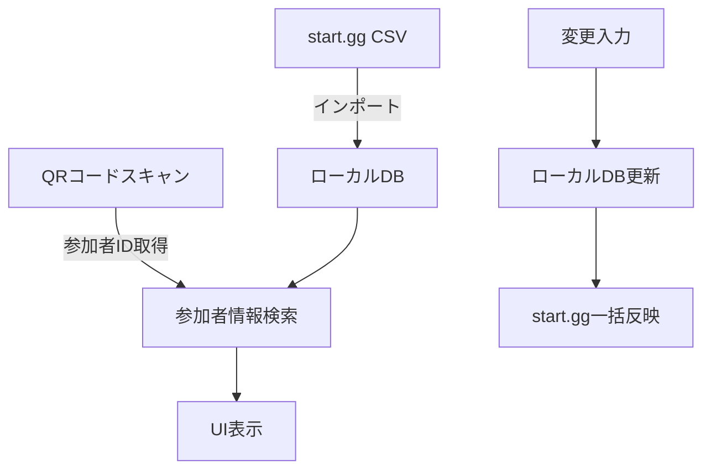
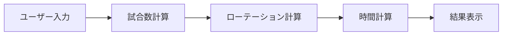

# TOHNO - システムパターン

## システムアーキテクチャ

### 全体構造
TOHNOは、Next.jsのApp Routerを使用したモノリシックなWebアプリケーションとして設計されています。

```
tohno-app/
├── app/                      # Next.js App Router
│   ├── layout.tsx            # 共通レイアウト
│   ├── page.tsx              # トップページ
│   ├── tools/                # ユーティリティツール
│   ├── dashboard/            # TO専用ゾーン
│   └── api/                  # APIエンドポイント
├── components/               # UIコンポーネント
├── lib/                      # ロジック/外部連携
└── styles/                   # スタイル定義
```

### コンポーネント関係
- **ページコンポーネント**: ルーティングとレイアウトを担当
- **UIコンポーネント**: 再利用可能なUI要素を提供
- **ロジックライブラリ**: ビジネスロジックと外部連携を担当

## 主要設計パターン

### 認証フロー
1. start.gg OAuthを使用した認証
2. NextAuth.jsによるセッション管理
3. 認証状態に基づいた条件付きUIレンダリング



### データフロー（受付高速化アプリ）
1. start.ggからCSVデータをインポート
2. ローカルDBに保存
3. QRコードスキャンによる参加者情報取得
4. ローカルDBからの高速データ参照
5. UIへのデータ表示
6. 変更をローカルDBに即時反映
7. start.ggへの一括反映



### 計算ロジック（所要時間試算ツール）
1. ユーザー入力の受け取り
2. トーナメント構造の計算
3. 所要時間の算出
4. 結果の表示



## 重要な実装パス

### トップページ
- ヒーローエリア
- ユーティリティセクション
- TO専用ゾーン

### 認証システム
- NextAuth.js設定
- start.gg OAuth連携
- セッション管理

### ユーティリティツール
- 所要時間試算ツール
  - 入力フォーム
  - 計算ロジック
  - 結果表示

### TO専用ツール
- 受付高速化アプリ
  - CSVインポート
  - QRコードスキャン
  - 参加者情報表示
  - 変更管理

## 拡張性設計
- 新規ツールの追加が容易なモジュラー構造
- APIエンドポイントの拡張性
- コンポーネントの再利用性